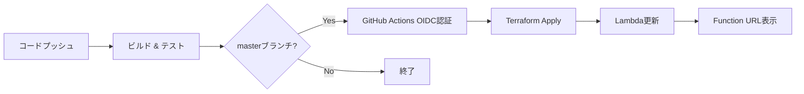

# デプロイメントガイド

このプロジェクトは、GitHub ActionsとTerraformを使用してAWS Lambdaをデプロイします。
AWS認証にはOIDC（OpenID Connect）を使用するため、アクセスキーを保存する必要がありません。

## 前提条件

- AWSアカウント
- GitHubリポジトリ
- Terraform CLIがローカルにインストールされていること

## 初回セットアップ

### 1. Terraformの変数を設定

`terraform/terraform.tfvars` ファイルを作成します：

```hcl
aws_region           = "ap-northeast-1"
lambda_function_name = "kotlin-lambda-hello-world"
github_org           = "your-github-username"  # あなたのGitHubユーザー名または組織名
github_repo          = "kotlin_lambda"          # リポジトリ名
```

### 2. Terraformで初回デプロイ（ローカルから）

初回のみ、ローカル環境からTerraformを実行してOIDCプロバイダーとIAMロールを作成します：

```bash
cd terraform
terraform init
terraform plan
terraform apply
```

デプロイが完了したら、以下のコマンドでGitHub Actions用のIAMロールARNを取得します：

```bash
terraform output github_actions_role_arn
```

出力例：
```
arn:aws:iam::123456789012:role/github-actions-deploy-role
```

### 3. GitHub Secretsを設定

GitHubリポジトリの Settings > Secrets and variables > Actions で、以下のシークレットを追加します：

| シークレット名 | 値 | 説明 |
|--------------|-----|------|
| `AWS_ROLE_ARN` | `arn:aws:iam::123456789012:role/github-actions-deploy-role` | 手順2で取得したIAMロールARN |
| `AWS_REGION` | `ap-northeast-1` | AWSリージョン |
| `GITHUB_ORG` | `your-github-username` | GitHubユーザー名または組織名 |

### 4. デプロイの確認

以降は、`master` または `main` ブランチにプッシュすると、自動的にデプロイが実行されます：

```bash
git add .
git commit -m "Setup GitHub Actions deployment"
git push origin main
```

GitHub Actionsのタブで実行状況を確認できます。

## デプロイフロー



## OIDCの仕組み

1. GitHub Actionsがジョブを実行
2. AWS STSに一時トークンをリクエスト
3. AWSがGitHubのOIDCプロバイダーで認証
4. 一時的なAWS認証情報を取得
5. Terraformがその認証情報でデプロイ

**メリット**：
- 永続的なアクセスキー不要
- より安全な認証
- 自動的にトークンがローテーション

## トラブルシューティング

### デプロイが失敗する場合

1. GitHub Secretsが正しく設定されているか確認
2. IAMロールのARNが正しいか確認
3. `terraform/terraform.tfvars` の設定が正しいか確認

### OIDCエラーが発生する場合

```
Error: Not authorized to perform sts:AssumeRoleWithWebIdentity
```

- `github_org` と `github_repo` の値が正しいか確認
- GitHubリポジトリ名が一致しているか確認

## ローカルから手動デプロイする場合

AWS CLIで認証している場合、ローカルからも実行できます：

```bash
cd terraform
terraform plan
terraform apply
```

## クリーンアップ

リソースを削除する場合：

```bash
cd terraform
terraform destroy
```
